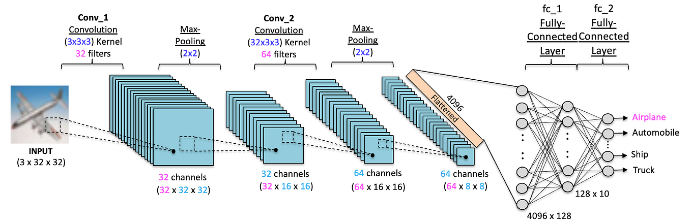

# 🧠 EEG-Based Mental Workload Classification Using Neural Networks
<p align="center">
  
</p>
<p align="center">
  <strong>From-Scratch Logistic Model vs Convolutional Neural Network</strong>
</p>

<p align="center">
  EEG • Mental Workload • Machine Learning • Deep Learning • CNN • Feature Selection
</p>

## 📌 Overview

This repository contains the implementation and experimental results for an **EEG-based mental workload classification** The project investigates whether EEG signals can be used to distinguish between two levels of mental workload:

- 🟢 **Low Workload**
- 🟠 **Medium Workload**

Two different approaches are investigated:

1. **Logistic classification implemented from scratch**
2. **Convolutional Neural Network (CNN)**

The project also investigates:

- 5-fold cross-validation
- Learning-rate selection
- Numerical stability
- Data shuffling
- Fourier-based feature selection
- Performance comparison between machine learning and deep learning

The main goal is to understand how **model complexity and feature representation affect EEG-based workload classification**.

---

# 🎯 Project Objectives

The project addresses the following objectives:

- Implement a logistic model without using a pre-built Logistic Regression classifier.
- Create separate functions for the main stages of the logistic learning algorithm.
- Develop a CNN-based deep learning model for workload classification.
- Implement 5-fold cross-validation.
- Investigate the effect of different learning rates.
- Investigate numerical instability during model training.
- Apply Fourier transformation for feature selection.
- Compare logistic and CNN performance.
- Compare performance before and after feature selection.
- Produce reproducible experiments using Jupyter notebooks.

---

# 🧠 Background

Mental workload describes the amount of cognitive effort required to perform a task.

Excessive mental workload can affect concentration, decision-making, and human performance. Accurate workload identification therefore has potential applications in:

- ✈️ Aviation
- 🚗 Driving and transportation
- 🧑‍💻 Human-computer interaction
- 🏥 Healthcare
- 🏭 Industrial safety
- 🧠 Brain-computer interfaces

**Electroencephalography (EEG)** provides a non-invasive way to measure electrical activity in the brain.

EEG signals contain information across different frequency bands:

| Frequency Band | Approximate Frequency | Common Association |
|---|---|---|
| Delta (δ) | 0.5–4 Hz | Slow-wave activity |
| Theta (θ) | 4–8 Hz | Memory and cognitive processing |
| Alpha (α) | 8–12 Hz | Relaxation and attention |
| Beta (β) | 12–30 Hz | Concentration and active cognition |
| Gamma (γ) | >30 Hz | Higher-level cognitive processing |

Because cognitive activity can influence EEG characteristics, EEG signals can be used as input to machine learning models for workload classification.

---

# 📊 Dataset

The experiments use EEG data containing two workload classes.

| Property | Value |
|---|---|
| Classification | Binary |
| Classes | Low Workload / Medium Workload |
| Total Samples | 360 |
| Samples per Class | 180 |
| EEG Channels | 62 |
| Data Points per Channel | 512 |
| Sampling Frequency | 256 Hz |

Each sample contains:

```text
62 channels × 512 data points
= 31,744 values
```
Therefore, the problem is characterised by a high-dimensional feature space and a relatively small number of samples.

This makes feature selection and model complexity particularly important.

# 🗂️ Repository Structure

```text
Mental-Workload-Classification-Neural-Networks/
│
├── README.md
│
├── notebooks/
│   ├── CE889_project_sigmoid.ipynb
│   └── CE889_project_tanh2.ipynb
│
├── .gitignore
└── .gitattributes
```

# 🔬 Experimental Workflow

The project follows the workflow below:

```text
                    EEG DATA
                       │
                       ▼
                Data Preparation
                       │
                       ▼
              Data / Label Extraction
                       │
                       ▼
             Train/Test Organisation
                       │
              ┌────────┴────────┐
              │                 │
              ▼                 ▼
        Logistic Model          CNN
        From Scratch
              │                 │
              └────────┬────────┘
                       │
                       ▼
               5-Fold Cross-
                  Validation
                       │
                       ▼
              Accuracy Evaluation
                       │
                       ▼
            Fourier Feature Selection
                       │
                       ▼
            Before / After Comparison
```
# 🔵 1. Logistic Model From Scratch

A key matter was to implement the **logistic model manually** rather than directly calling a pre-built logistic regression algorithm.

The logistic model was therefore implemented **from scratch**, with the main learning steps separated into individual functions.

## 🔄 Forward Propagation

The model first calculates the linear combination:

```text
Z = WᵀX + b
```
The sigmoid activation function is then applied:
```text
ŷ = sigmoid(Z)
```
where:

- `X` = input features
- `W` = model weights
- `b` = bias term
- `ŷ` = predicted probability

The predicted probability is then compared with the **ground-truth label** to calculate the loss.

## 🧮 Gradient Calculation

The implementation calculates gradients for:

- **Model weights**
- **Model bias**

These gradients determine how the model parameters should be adjusted during training to reduce the loss.

---

## 📉 Gradient Descent

The model parameters are updated using the **gradient descent** optimisation algorithm:

```text
W = W - αdW
```
```text
b = b - αdb
```

where α represents the learning rate.

The process is repeated over multiple iterations to minimise the loss.

# 🟠 2. Sigmoid Experiment

The first implementation used the **sigmoid activation function**.

During experimentation, numerical instability was encountered.

The sigmoid function contains an exponential operation, and very large positive or negative values can lead to numerical problems.

This resulted in unstable loss values, including `NaN` values during some experiments.

The sigmoid notebook is retained in the repository because it documents the **initial experimental stage and development process**.

---

# 🟣 3. Tanh Experiment and Correction

A second implementation was created using the **tanh activation function**.

The `CE889_project_tanh2.ipynb` notebook also contains the corrected **data-shuffling procedure** used for cross-validation.

This was an important correction because an incorrect shuffling procedure can lead to unreliable train/test partitions and potentially misleading classification results.

The corrected notebook is therefore the **preferred notebook for reproducing the final experiment**.

# 🔄 4. Five-Fold Cross-Validation

The models were evaluated using **5-fold cross-validation**.

The dataset contains **360 samples**:

```text
360 / 5 = 72 samples per fold
```
Therefore, for each fold:
```text
Training samples = 288
Testing samples  = 72
```

The cross-validation process is repeated five times, with each sample being used as part of the test set exactly once.

#### 🔁 Cross-Validation Procedure

```text
                 360 EEG Samples
                        │
                        ▼
              ┌───────────────────┐
              │   5-Fold Split    │
              └───────────────────┘
                        │
       ┌────────────────┼────────────────┐
       │                │                │
       ▼                ▼                ▼
    Fold 1           Fold 2           Fold 3
   288 / 72         288 / 72         288 / 72
       │                │                │
       └────────────────┼────────────────┘
                        │
                  ┌─────┴─────┐
                  │           │
                Fold 4      Fold 5
               288 / 72    288 / 72
                  │           │
                  └─────┬─────┘
                        │
                        ▼
                Mean Accuracy
```
The mean accuracy across the five folds is used as the overall performance measure.

# 🧠 5. CNN Model

A **Convolutional Neural Network (CNN)** was selected as the deep learning model.

CNNs can learn **nonlinear and hierarchical representations** from input data, making them suitable for comparison with the simpler logistic model.

The CNN provides greater model capacity and can potentially identify patterns in EEG data that cannot be represented effectively by a simple linear decision boundary.

The deep learning implementation uses a **publicly available deep learning framework**.


---

# 🔬 6. Fourier Feature Selection

The original EEG representation contains:

```text
31,744 values per sample
```
This is a very large feature space compared with the number of available samples.

Fourier transformation was therefore investigated to represent EEG information in the frequency domain.

The purpose was to investigate whether reducing the feature space could improve classification.

The experiments compare:

### Without feature selection
```text
Raw EEG
   ↓
Model
   ↓
Accuracy
```
### With feature selection
```text
EEG
 ↓
Fourier Transformation
 ↓
Selected Features
 ↓
Model
 ↓
Accuracy
```

Both the logistic model and CNN were evaluated using the feature-selection approach.

# ⚙️ 7. Learning-Rate Investigation

Different learning rates were tested during the logistic-model experiments to investigate their effect on optimisation and convergence.

The reported loss values were:

| Learning Rate | Reported Loss |
|---|---:|
| `1 × 10⁻⁹` | 1.38 |
| `1 × 10⁻⁷` | 1.36 |
| `1 × 10⁻⁵` | 1.26 |
| `1 × 10⁻⁵*` | 0.805 |

The results demonstrate that the **learning rate has a strong influence on optimisation and convergence**. Selecting an appropriate learning rate is therefore important for achieving stable training and effective model performance.

---

# 🔎 Feature Selection Results

The reported experiments using **Fourier-based feature selection** produced approximately:

| Model | Before Feature Selection | After Feature Selection |
|---|---:|---:|
| Logistic Model | ~49% | ~71% |
| CNN | ~74% | ~78% |

The improvement for the logistic model was considerably larger than for the CNN.

A possible explanation is that the logistic model has **limited representational capacity** and therefore benefits strongly from reducing irrelevant or redundant input features.

The CNN, in contrast, can learn **nonlinear representations** directly from the original input and may therefore gain less from manually reducing the feature space.

---


# 🏆 Main Findings

### 1. 🧠 CNN Outperformed the Logistic Model

The **CNN achieved considerably higher classification accuracy** than the from-scratch logistic model.

### 2. 🔎 Feature Selection Improved Logistic Performance

The **Fourier-based feature-selection experiment** produced a substantial improvement for the logistic model.

### 3. 📈 CNN Performance Remained Relatively Strong

The CNN performed well without feature selection, suggesting that it can learn useful representations from the original EEG data.

### 4. ⚙️ Learning Rate Affects Optimisation

The learning-rate experiments demonstrated that inappropriate learning rates can negatively affect convergence.

### 5. 🔄 Correct Shuffling Is Essential

The project identified and corrected a problem with the data-shuffling procedure.

This demonstrates that machine-learning performance depends not only on the model but also on the correctness of the overall experimental pipeline.

---

# ⚠️ Limitations

Several limitations should be considered when interpreting the results.

## 📊 Dataset Size

The dataset contains only **360 samples**, while each sample contains **31,744 EEG values**.

This creates a challenging **high-dimensional, low-sample-size problem**.

## 🧠 Potential Overfitting

A CNN has considerably greater capacity than logistic regression and can potentially **overfit a small dataset**.

Additional validation would be useful to determine whether the learned patterns generalise beyond the available data.

## 🏷️ Binary Classification

Only **Low** and **Medium** workload levels were considered.

Future work could investigate **multi-class workload classification** using additional workload levels.

## 🌍 Generalisation

Further experiments using **unseen participants** would provide stronger evidence of model generalisation.

This would help determine whether the models learn general EEG workload patterns rather than participant-specific characteristics.

## 🔄 Validation Strategy

**5-fold cross-validation** was used in this project.

If multiple observations originate from the same participant, **subject-independent validation** would be a useful future improvement.

This approach would reduce the risk of information leakage between training and testing data and provide a stronger evaluation of real-world generalisation.

# 🚀 Future Work

Several possible extensions could further improve the EEG-based mental workload classification system.

## 🧠 Advanced EEG Models

Future experiments could investigate more advanced deep learning architectures, including:

- **EEGNet**
- **DeepConvNet**
- **CNN-LSTM**
- **LSTM**
- **GRU**
- **Transformer-based architectures**
- **Graph Neural Networks (GNNs)**

These approaches could potentially capture more complex **temporal, spatial, and nonlinear patterns** within EEG signals.

---

## 🔬 Improved Feature Extraction

Additional EEG feature-extraction techniques could be investigated, including:

- Frequency-band power
- Relative band power
- Spectral entropy
- Hjorth parameters
- Wavelet features
- Time-frequency representations
- Spatial EEG features
- Functional connectivity

Combining time-domain, frequency-domain, and spatial information could provide richer representations of mental workload.

---

## 👥 Improved Validation

A future version of the project could use:

```text
Leave-One-Subject-Out Cross-Validation
```
This would evaluate the model using completely unseen participants and provide a stronger assessment of subject-independent generalisation.

### ⚙️ Hyperparameter Optimisation

Future experiments could systematically optimise the following hyperparameters:

- **Learning rate**
- **Batch size**
- **Number of epochs**
- **Number of CNN filters**
- **Kernel size**
- **Number of layers**
- **Dropout rate**
- **Optimiser**
- **Activation function**

  # 💻 How to Use

Follow the steps below to set up and run the project.

## 1. Clone the Repository

Clone the repository and navigate to the project directory:

```bash
git clone https://github.com/zeinabdastmozd/Mental-Workload-Classification-Neural-Networks.git
cd Mental-Workload-Classification-Neural-Networks
```
## 2. Install Python dependencies

The notebooks require the scientific Python and deep-learning libraries used by the implementation.

For example:
```bash
pip install numpy scipy pandas matplotlib scikit-learn tensorflow jupyter
```
If additional libraries are imported by the notebooks, install those packages as well.

## 3. Obtain the dataset

The dataset is not distributed through this repository.

Obtain it through the dataset source provided in the CE889-SP Lab 6 materials.

## 4. Open Jupyter Notebook
jupyter notebook

Then navigate to:

notebooks/

# ▶️ Recommended Experiment Order

For the clearest reproduction of the project:

## Step 1 — Original sigmoid experiment

Open:
```bash
notebooks/CE889_project_sigmoid.ipynb
```
This notebook documents the initial implementation and experimentation with the sigmoid-based logistic model.

## Step 2 — Corrected experiment

Open:
```bash
notebooks/CE889_project_tanh2.ipynb
```
This notebook contains the later corrected implementation, including the corrected shuffling procedure and tanh-based experiment.

## Step 3 — Compare results

Compare:

Logistic model
CNN
Before feature selection
After feature selection
Five-fold accuracy
Mean accuracy

# 📁 Reproducibility

The notebooks are provided to make the **experimental process transparent and reproducible**.

The recommended workflow is:

```text
Dataset
   │
   ▼
Load EEG Data
   │
   ▼
Extract Labels
   │
   ▼
Prepare Input Representation
   │
   ▼
Train Model
   │
   ▼
5-Fold Cross-Validation
   │
   ▼
Calculate Fold Accuracies
   │
   ▼
Calculate Mean Accuracy
   │
   ▼
Fourier Feature Selection
   │
   ▼
Repeat Classification
   │
   ▼
Compare Results
```
The final corrected notebook should be used when reproducing the final reported results.


---

# 👤 Author

**Zeinab Dastmozd**

**Project:** EEG-Based Binary-Class Workload Identification Using Feature Fusion and Selection

